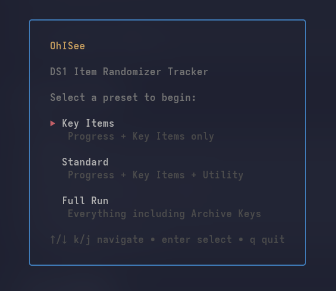
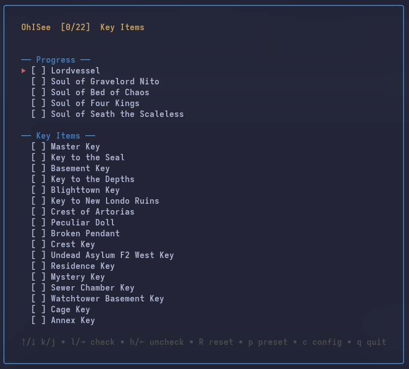

# OhISee

**OhISee** is a TUI Item Tracker for Dark Souls Remastered




## Features
- Check off every important Item in an Item Randomizer
- 3 Presets (Key Items, Standard & Full Run)
- Customizable Item config

## Installation

## Linux

### With Brew
```bash
brew install cometpuppy/ohisee/ohisee
```
Now just run `ohisee` from your Terminal.

### Manual
Download the ohisee_linux_amd64/arm64.tar.gz from the Releases Page

Extract it and run ./ohisee from the directory
```bash
tar -xzf ohisee_linux_amd64.tar.gz
./ohisee
```

## Windows
Download the ohisee_windows_amd64.zip from the Releases Page

Extract it and run the ohisee.exe

It will show a "Windows protected your PC" prompt — this is because OhISee is not code-signed, not because it's harmful. Click "More info" → "Run anyway".
